# Game Design Document (GDD) Team - Secrets
___
## Table of Contents
### [Part 1 - Game Overview](#part-1-game-overview)
1. [Introduction](#introduction)
2. [Core Concept](#core-concept)
3. [Target Audience](#target-audience)
4. [Unique Selling Point](#unique-selling-point)
### [Part 2 - Story and Narrative](#part-2-story-and-narrative)
1. [Backstory](#backstory)
2. [Player - Amily](#player---amily)
3. [Big Boss - Orphanage director](#big-boss---orphanage-director)
4. [Big Monster - Wolves](#big-monster---wolves)
5. [Wraith](#wraith)
6. [Monsters](#monsters)
### [Part 3 - Gameplay and Mechanics](#part-3-gameplay-and-mechanics)
1. [Player perspective](#player-perspective)
2. [character.Controls(input)](#charactercontrolsinput)
   1. [Character movement](#-character-movement-)
3. [progression](#progression)
   1. [Target](#-target-)
4. [Gameplay mechanics](#gameplay-mechanics)
   1. [Exploration and collection](#-exploration-and-collection-)
   2. [Combat](#-combat-)
### [Part 4 - Levels and World Design](#part-4-levels-and-world-design)
1. [Game World](#game-world)
2. [Map Design](#map-design)
   1. [First stage](#-first-stage-)
   2. [Room Preview](#-room-preview-)
3. [Objects](#objects)
   1. [Environmen](#-environment-)
   2. [Enemy objects](#-enemy-objects-)
   3. [Player objects](#-player-objects-)
   4. [Interactive equipments](#-interactive-equipments-)
4. [Physics Mechanics](#physics-mechanics)
   1. [Battle system](#-battle-system-)
   2. [character system](#-character-system-)
   3. [Environment system](#-environment-system-)
### [Part 5 - Art and Audio](#part-5-art-and-audio)
1. [Art Style](#art-style)
2. [Sound and Music](#sound-and-music)
   1. [Background music](#-background-music-)
   2. [Sound Effect](#-sound-effect-)
3. [Assets](#assets)
### [Part 6 - User Interface (UI)](#part-6-user-interface-ui)
### [Part 7 - Technology and Tools](#part-7-technology-and-tools) 
### [Part 8 - Team Communication, Timelines and Task Assignments](#part-8-team-communication-timelines-and-task-assignments)
1. [Team Member](#team-member)
2. [Team Communication](#team-communication)
   1. [Slack](#-slack-)
   2. [Meeting schedule](#-meeting-schedule-)
   3. [Trello Board](#-trello-board-)
3. [Timelines](#timelines)
   1. [Preparation](#-preparation--from-week-1-to-week-4)
   2. [Began Foundational Game Development](#-began-foundational-game-development--from-week-3-to-week-6)
   3. [Expansion of Gameplay content (If given enough time)](#-expansion-of-gameplay-content-if-given-enough-time--)
   4. [Game Testing and Optimization](#-game-testing-and-optimization-)
### [Part 9 - Possible Challenges](#part-9-possible-challenges)

## Part 1 Game Overview

### Introduction

Amily has lived in the historic Rainbow Haven orphanage since she was a child, but what she doesn't realize is that while the orphanage is a warm and caring home for orphans, there is a huge organization that traffics in children's organs behind the scenes. In the suspenseful adventure of Secrets, you will take on the role of Amily, a young orphanage girl, and escape from the eerie atmosphere of the orphanage to find the truth. As the rain pours down, Amily faces the darkness of the orphanage alone, can she survive the hunt and uncover the orphanage's dark secrets? It's all in the hands of the player.

### Core Concept

Similar to the popular survival-adventure **Little Nightmares** franchise, our game bears a strong resemblance to Little Nightmares in terms of the single-player adventure-type gameplay genre, player goals and motivations.

The theme of Little Nightmares is “Greed, Lust and the Adult World”;

But contrary to the unique selling points of Little Nightmares' intricate decryption mechanics and vast, explorable open-world environments, Secrets focuses more on exploration and escape within claustrophobic environments, where fighting fast and escaping is paramount when faced with an onslaught of enemies, and where stress and fear are the motivations that drive players to want to find the exit.

The core concept of Secrets is to avoid the kind of scare and gore horror design, instead focusing on creating atmosphere, gameplay, scenarios, and characters that keep the player on the edge of their seat at all times. The dark, twisted, nightmarish scenarios are contrasted with cute, innocent, iconic girls, and the game is designed to be full of tension rather than horror per se.

In addition, as a survival adventure game, we provide exploration, fighting and decryption mechanisms, diversified gameplay requires players to hold a rational brain under the tension, only the brave and calm people can win the game!

In short, Secrets is committed to immersing players in the real world and enhancing their inner strength and sense of responsibility towards society. We hope that by using the game as a vehicle, the portrayal of Amily's struggle to overcome the difficulties at hand and her bravery in the face of darkness will inspire players, and also remind them that they should learn to distinguish between truth and illusion, and that they should have their own views and attitudes towards the people and things around them in real life.

### Target Audience

According to the classic gamer categorization proposed by Richard Bartle in 1996, the game's target audience is exploratory and accomplished gamers between the ages of 18 and 24 or so.

With a total duration of 10-12 minutes, the game itself does not contain a complex terrain or combat system and is extremely easy to pick up. However, it requires the player to be calm and rational in the face of impending danger, as the slightest mishap may lead to danger and being trapped in filth forever.

The overall scene of the secret is rich and the story line is complete. Scenes such as halls, bedrooms, laboratories and more await to be unlocked by players, so to escape, try fighting the principal and weird creatures and walking throughout the premises while unraveling the secrets! In addition to this, players will need to keep their weapons handy at all times, as the orphanage is full of crises and monsters can be encountered and fought at any time. Defeating the monsters may result in rewards and equipment, and only careful and brave players will be able to find the secrets of the orphanage and gain their freedom!

### Unique Selling Point

Secrets is set up to be progressively more difficult, with modes of exploration, evasion and combat interspersed. There is no linear development path that the player must complete, and each monster is optional (but without fighting, we likely won't be able to face the final enemy!) ), but if you want to leave the final gate, you will inevitably have to fight the big bosses. Overall, the game gives the player a fair amount of control and freedom, but with a certain amount of scenario planning to ensure a good experience.

**1.4.1 Quirky drawings and immersive atmosphere**
The game utilizes a gothic-like low polygon art style that combines modern and classic elements to create a disturbing yet appealing visual experience. The dark color scheme and fine background details, such as the eerie rooms in the dilapidated orphanage with dim lights that flicker on and off, enhance the mysterious and macabre atmosphere of the game. In addition, we also took into account that visual elements and details are extremely effective means of conveying character, so each character's clothing, color choices, and physical interactions were carefully designed to reflect their inherent personality traits and backstory.

 **1.4.2 Functional elements are rich and varied**
The game combines multiple gameplay elements such as exploration, escape and challenge. Each mechanic is carefully designed to support and enhance the storytelling.

 **1.4.3 Story Theme Sublimation**
The Secrets is more than just a simple escape story, the main theme can be centered around **"Finding a true home and a sense of belonging ”**. Amily, as an abandoned orphan since she was a little girl, the orphanage is the glimmer of hope she grasps in her most helpless moments. The desire for “home” is not only Emily's wish, but can also be a metaphor for the game, symbolizing the process by which each of us seeks a “place to belong”. However, as the truth about the orphanage is revealed, this “home” suddenly becomes strange and scary, shattering all her beautiful fantasies.

Under this theme, Amily is not only running away from danger, but also from the illusory shelter in which she has placed all her hopes. Every time she avoids capture and solves a mystery, she is constantly reinventing her perception of “home” and “safety”. Perhaps by the end of the game, Amily will realize that the real “home” is not a specific place, but her own inner strength.

 **1.4.4 Keeping up with current social events**
The game's story, although set in an orphanage, delves into broader social issues such as privacy invasion, surveillance society and human rights. These elements are skillfully incorporated through in-game clues, allowing players to contemplate current social hotspots while playing the game. This design not only makes the game educational, but also increases its real-world relevance and appeal.

## Part 2 Story and Narrative

### Backstory

In a remote town, there is a seemingly ordinary and harmonious named **Rainbow Haven Orphanage**. The children here live a carefree life, playing and learning every day, seeing this place as a haven.

As the seasons change, Amily's life in the orphanage progresses day by day, Amily is happy to have made many good friends and considers the orphanage her warmest and safest home. On a gloomy afternoon in June, the last of Amily's friends in the main character's bedroom is about to be “adopted”. On the day of the adoption, Amily does not go to see her off, but hides in her bed and cries alone. However, Amily realizes that her little friend has forgotten his favorite toy on the sofa, so she picks up the toy and leaves the bedroom in a hurry to look for her friend.

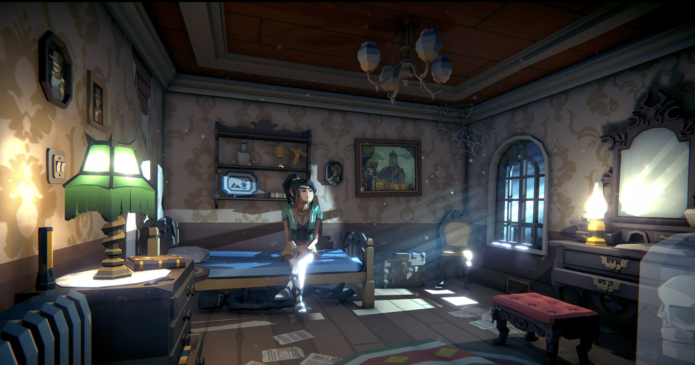

When Amily pursues to the “**forbidden**” part of the orphanage, she finds that her friends have been taken into a room that is normally off-limits to the children. Curiosity and a sense of duty lead her to peek through the door, but she is shocked by what she sees. Inside the room, a group of people in medical uniforms were gathered in a circle to perform an operation, and lying on the operating table was none other than hierlittle friend. At this moment, the always amiable dean just stood coldly on the sidelines, witnessing all this. Amily was so horrified that she couldn't believe her eyes. At that very moment, the nervous girl accidentally dropped the toy in her hand, making a crisp sound. This unexpected sound caught the attention of everyone in the room, and eyes turned to the doorway.

Driven by fear, Amily quickly turned around to escape, the guard system inside the orphanage instantly activated, the lights around began to dim, and the whole orphanage was plunged into an eerie atmosphere. When the game started, it meant that Amily's road to escape had officially begun, and Amily knew that she had to find the key as soon as possible to escape from this horrible place, or else the same fate would be waiting for her. The orphanage turns into a place full of danger and mystery, with monsters watching from the shadows and the dean closing in on her......

### Player - Amily

+ Name: Amily

+ Age：11

+ Identity：A little girl who grew up in an orphanage without a mother or father.

+ Personality: Smart, brave, compassionate,  fall of justice

+ Appearance：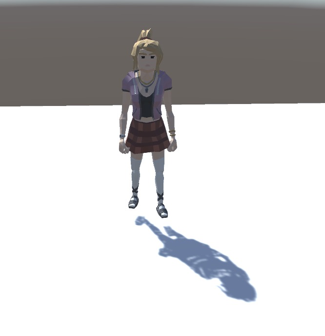

+ Character motivation: At first, he just wants to return his friend's toys, but after witnessing the truth, he decides to escape from the orphanage and expose the director's conspiracy.

+ Goal: Find the key, escape the orphanage, avoid being captured by the monster

### Big Boss - Orphanage director

+ Name: Kyle

+ Age：unkown

+ Identity：The director of the orphanage is actually the leader of the organization that sells children's organs

+ Personality: Sinister, cold, cunning, kind on the outside, but evil on the inside

+ Appearance：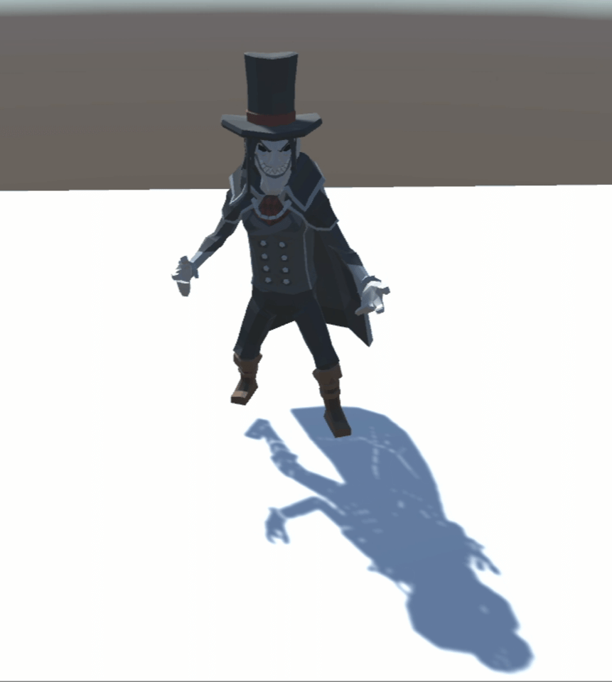

+ Character motivation: The selfishness of dissecting children's organs and selling them, and seemingly wanting to extract the children's blood to sustain their own lives

+ Game Goal: To prevent Amily from escaping from the orphanage, his secret is revealed

### Big Monster - Wolves

+ Name: Wolves

+ Age：99

+ Identity：Giant monsters who only listen to the director

+ Personality: Grumpy, stubborn

+ Appearance：to be confirmed

+ Character motivation: In order to survive and can only listen to the director at any time because of being imprisoned by the director. 

+  Goal: Stop Amily from leaving the orphanage

### Wraith

+ Identity：The kids who were once innocently murdered have congealed evil spirits because they were so miserable

+ Personality: Crying, sad, angry

+ Appearance：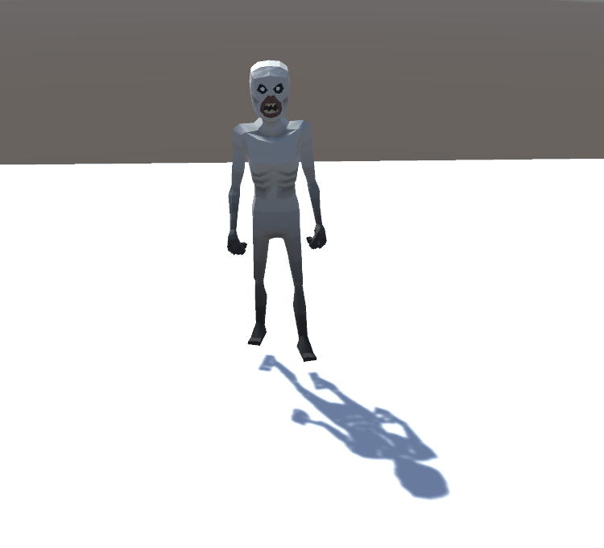

+ Character motivation: They attack on the scent of a human being

  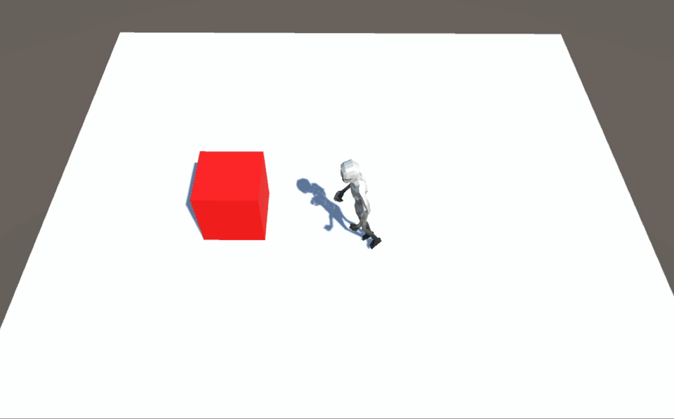

### Monsters

+ Identity：Nameless monster

+ Personality: Unconscious, controlled, violet

+ Character motivation: The director's little monster, except that the director attacks anyone they encounter

+ Appearance:

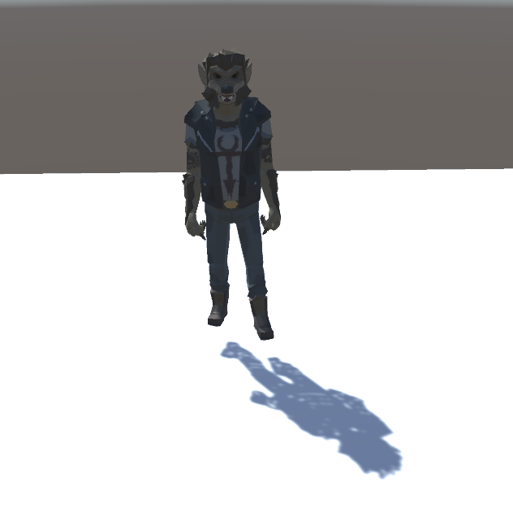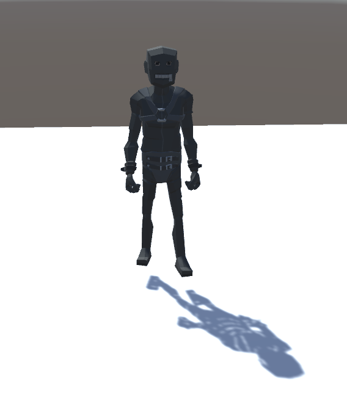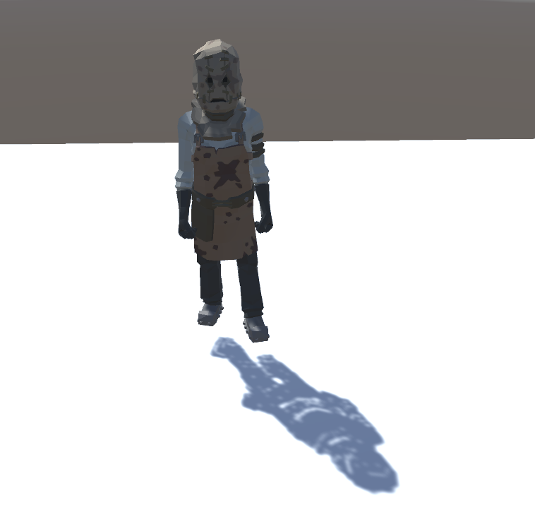

## Part 3 Gameplay and Mechanics

### Player perspective

In this game, the player controls the little girl, Amily, from a third-person perspective, a view that allows the player to visualize the character's body language more intuitively. The player's back appears in the screen, and this perspective allows the player to clearly see how the character and her surroundings interact with each other so that they can better navigate and interact with each other. The player is free to move around the designated area and explore the orphanage and its surroundings. The camera view moves with the player, increasing realism and immersion.

### character.Controls(input)

The controls follow the format of a traditional third-person perspective action game, with additional buttons assigned to allow the player to interact with the environment.

##### +++ Character movement +++

| keys                | movement                       |
| ------------------- | ------------------------------ |
| W, S, A, D          | forward, backward, left, right |
| Ctrl                | crouching                      |
| Space（hold）       | Jump                           |
| Light-click (mouse) | normal attack                  |
| E                   | Quick weapon switching         |
| Left shift          | sprinting                      |

### progression

Stage 1: Players start from the corridor side of the orphanage as the starting point. At the beginning of the game, the orphanage has been locked with a key, and the player needs to explore and collect clues and traces from the scene to find the key to the door on the first floor. Players can try to explore the accessible rooms of the orphanage, but in the meantime, they are likely to encounter the ghosts of the orphanage or the small monsters raised by the director, and they will need to run away, fight with empty fists, or use the weapons they have collected to fight with the monsters or the ghosts.
Stage 2: Upon opening the door to the first floor, the player will be confronted by the largest and hardest to defeat Wolves, which can only be defeated with experience and advanced weapons. If the player chooses to escape from the monsters in the first stage or take a shortcut to escape from the orphanage, he or she will be captured by the Walves due to the disparity in attack power and blood value, and will fail to escape.

**+++ Failure condition +++**

+ Blood bar goes to 0 in the middle of a fight with a small monster: the player has lost all life points and will be captured by the npc currently fighting and taken to the lab.

+ Killed by Final Wolves: If the player fails to successfully defeat or confuse the Wolves, the player loses all life points and fails the game and is taken to the lab.

+ Running out of time: If time runs out and the orphanage's security system is complete, Emily will have no chance of escaping again and will end up being captured by the Director and taken to the lab.

##### +++ Target +++

The ultimate goal is to complete the first and second stages within 10 minutes, find the key clue and defeat the big monster kept by the director to look at the iron door of the orphanage, successfully use the golden key to open the big iron door, and escape from the orphanage with the evidence of the director's guilt.

### Gameplay mechanics

##### +++ *Exploration and collection* +++

Players can explore any accessible scene in the game, but they should do so logically. The game takes the player's starting point as a radius, and the farther away the randomly generated monsters are, the higher the force value, and the easier it is to get caught and fail to escape. Therefore, players should explore the game gradually, looking for items to enhance their fighting ability or find a magical potion to restore their life value, rather than taking shortcuts as a breakthrough game. This is the way to find the evidence of Dean's guilt and really break through to become a brave and powerful person, feeling the meaning behind the secret.

##### +++ Combat +++

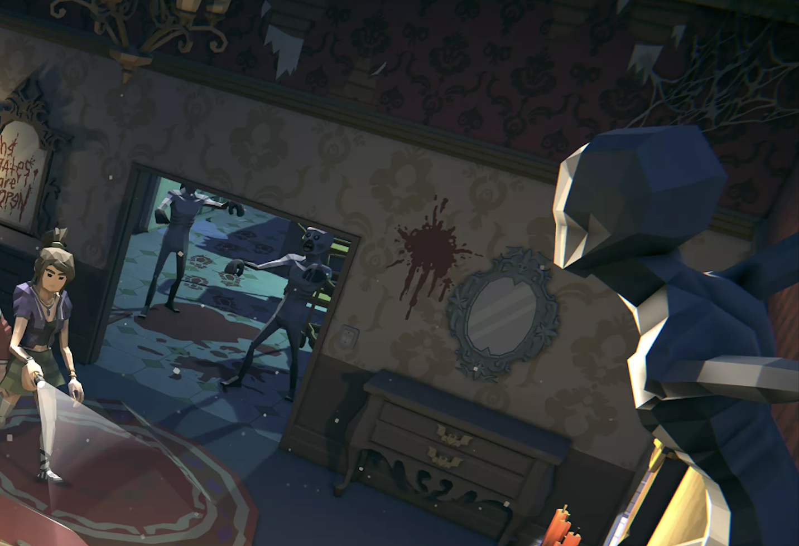

In the battle state, both sides' blood values can be displayed on the screen.

1. Blood Value

+ The small monsters and specters roaming the courtyard have a total blood value of 50. When the player successfully defeats one, the player gets 20 points of blood back. When the player is hit by an attack, the player's blood is reduced by 10.
+ The walves guarding the gate outside the courtyard have a total blood count of 150, and when the player displays a walve, he or she receives a treasure chest containing a golden key to escape the gate.
+ Main character Amily's total blood level is 200, when her life level reaches 0, it means the game is over and she has failed to escape.

2. The player chooses different attacks that will cause different levels of damage to the enemy:

   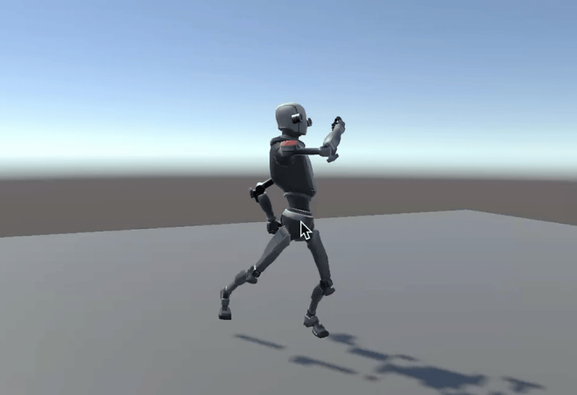

+ Close Combat . When the protagonist swings his fist to hit an enemy once, the enemy's blood is reduced by 10. after three consecutive hits, it is reduced by an additional 5.

+ Magic Attack . When the protagonist hits an enemy once with a magic cannon, the enemy's blood volume is reduced by 20. after three consecutive hits, the enemy's blood volume is reduced by an additional 10. + Magic Attack.

+ Axe: When the Protagonist swings an axe and hits an enemy once, the enemy's blood is reduced by 30. three consecutive hits reduce the enemy's blood by an additional 15.

3. Backpack system

Players have a backpack system that holds collected weapons, bloodstain recovery props, keys, and evidence of Dean's guilt.

## Part 4 Levels and World Design

### Game World

For the start page and the settings page, we will use the interior of the orphanage in dark shades as the background, accompanied by melancholic background music, and the layout is designed in 2.5D or 2D style. Considering the length of the game and the logical continuity, the game will have only one level, but the game will gradually increase in difficulty.

The game world uses 3D technology to build characters, scenes, props and npcs to provide better visual effects and game mechanics. The entire game scene layout uses dark tones and polygonal horror style to enhance the mystery and fun of the game.

The game contains a variety of rooms, including dorm rooms, hallways, and Kitchen, each with a unique layout. Players need to explore the rooms or find props in order to get the information to open the doors. In addition, each scene will be ambushed by strange creatures, devices that will attack the player and reduce their life value, thus increasing the challenge and tension of the game.

In addition, players can use the keyboard to scroll around the scene and perform actions such as running, jumping and tapping the keyboard. Since this is an escape game, we won't be providing a map to the player; they will need to complete the game through their own exploration.

### Map Design

##### +++ first stage +++

In the first stage we mainly concentrated on building the scene on the first floor of the orphanage, where monsters will be randomly dropped anywhere in the map. The style of the scene is consistent and its main places are:

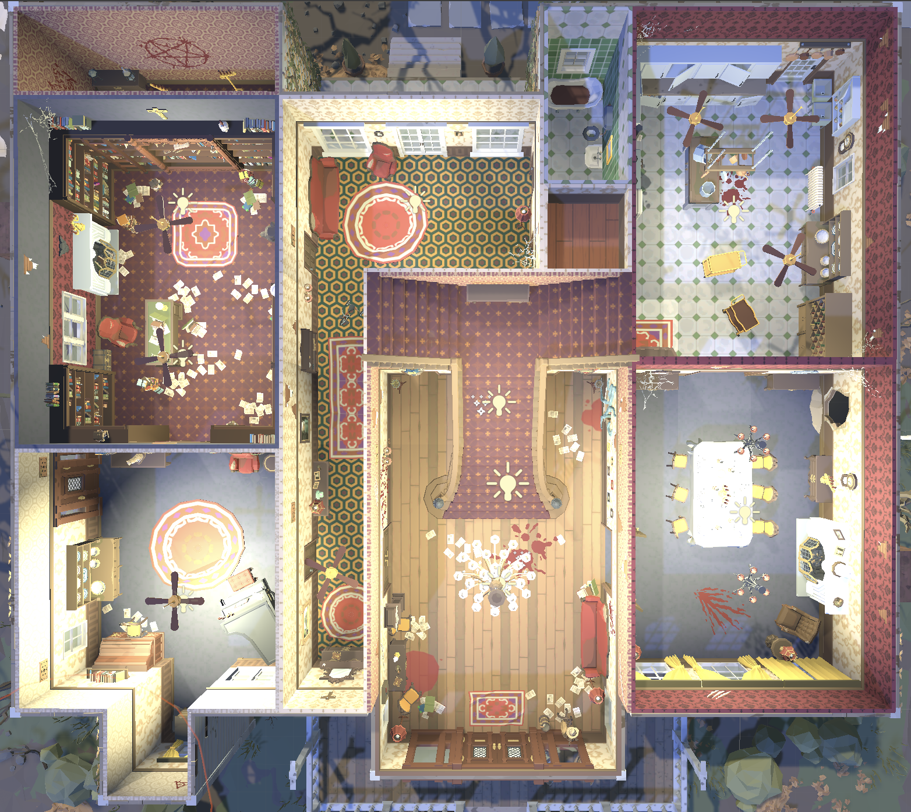

##### +++ Room Preview +++

+                                                Director's Office Room

  The core secret hidden throughout the orphanage, the principal's incriminating evidence of human trafficking, will be found in the principal's office area, hence the strong enemy generation force in that space.

+ 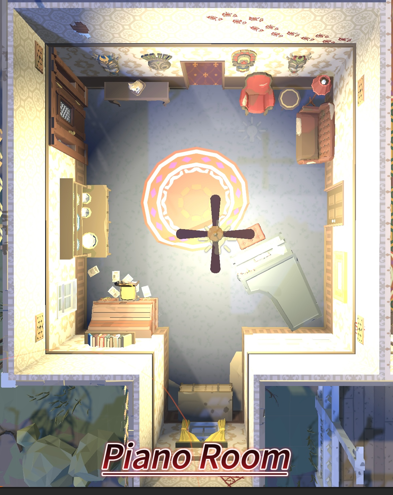                                   		        Piano Room

  A beautiful and wild piano melody is playing, who is playing the piano? Defeat the creature in the piano room and gain mysterious power.

+ 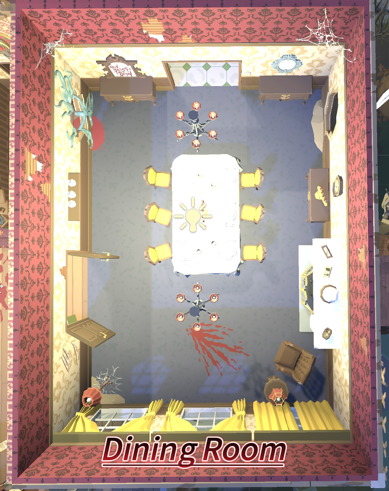                                                 Dinning Room

+ 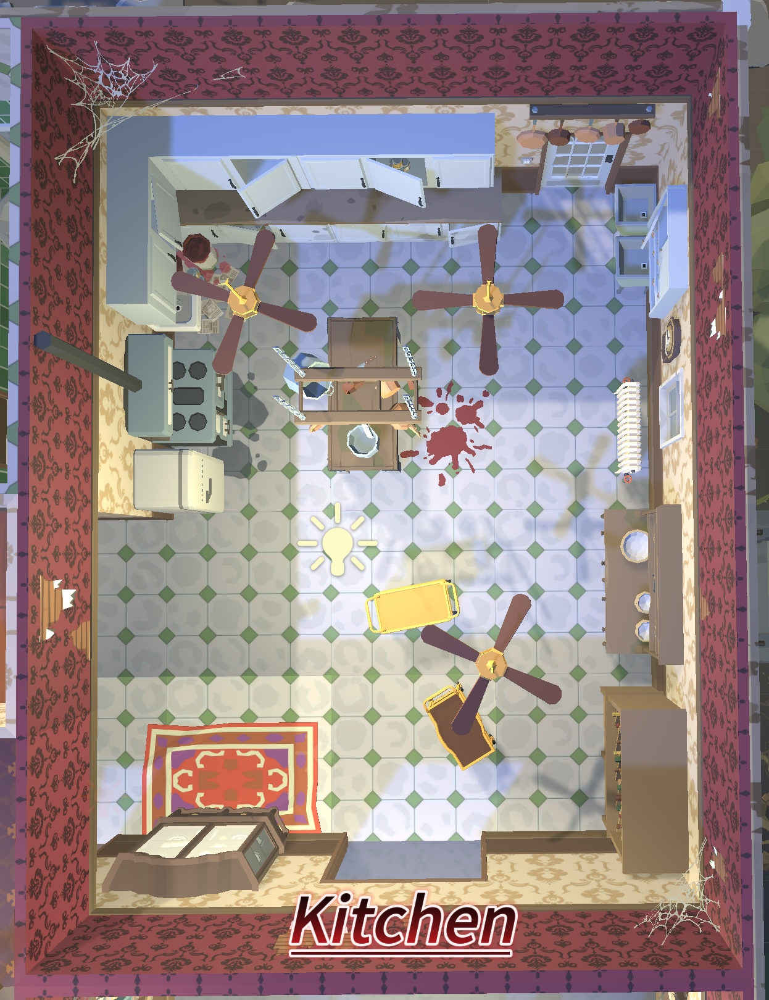                                                            Kitchen

+ 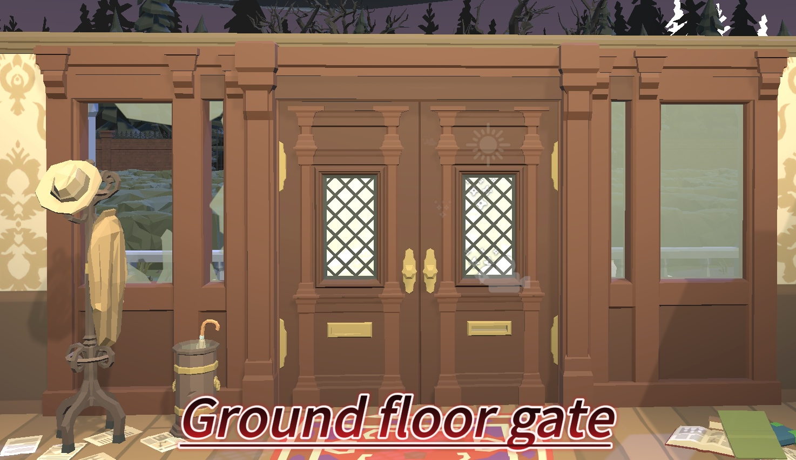                                      Ground Floor Gate

**+++ second stage +++**

Phase II:

1. The central build in the second stage is a small underground laboratory where the player needs to defeat strong creatures and trigger the silver key (located in a treasure chest) that opens the door to the first floor. The main facilities in this lab should have specialized medical equipment, surgical beds, medicine chests, and other standard hospital features. It will also be equipped with coffins and photos of once-murdered orphanage children to enhance the thematic atmosphere.

2. (_If development time permits_), the plan is to continue the traditional style of expanding the second floor so that there is more living space to explore.

- dormitories
- bathroom 
- corridors

### Objects

##### +++ Environment +++

Environmental objects, mainly doors, walls and fixed decorative components, serve as the basic elements of the main scene. These objects help shape the game world and provide context for player interaction. The player is able to interact with certain environmental objects that affect the gameplay. 

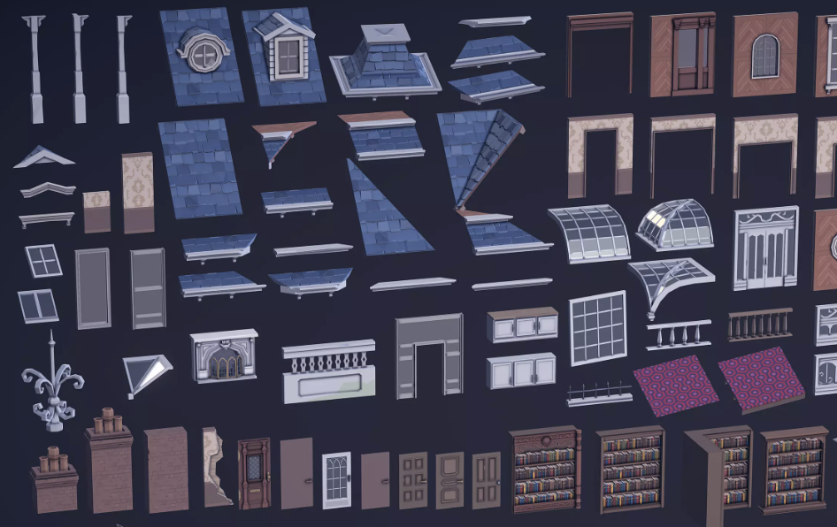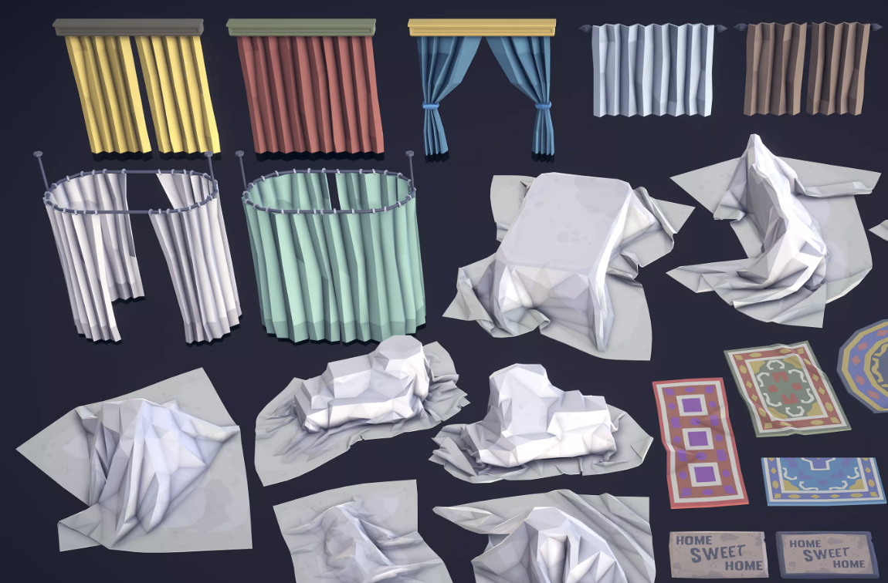

##### +++ Enemy objects +++

Enemy objects include models of Director Kyle, Walves, Wraith, and Monsters. The enemy has an attack mode, and the attack weapon can interact with the protagonist, and generate blood damage to the protagonist after interaction.

| objects       | description                |
| ------------- | -------------------------- |
| Director Kyle | body model of the Kyle     |
| Walves        | body model of the Walves   |
| Wraith        | body model of the wraith   |
| Monsters      | body model of the monsters |
| Weapons       | enemy projectiles          |

##### +++ Player objects +++

Player objects, mainly the body of the Amily.

| objects | description             |
| ------- | ----------------------- |
| Amily   | body model of the Amily |

##### +++ interactive equipments +++

Interactive equipment items scattered throughout the castle that the player can interact with. Some objects have the potential to significantly impact the player character's stats and abilities.

| objects        | description                                                  |
| -------------- | ------------------------------------------------------------ |
| Key            | The key used to open the two doors, the first floor exit is a silver key, out of the big iron door is a gold key. |
| Treasure chest | A treasure chest for the key.                                |
| Axe            | Weapons obtained after defeating the corresponding enemy can be placed in the backpack. |
| Portfolio      | All the evidence against the orphanage director.             |
| Magic spell    | Weapons obtained after defeating the corresponding enemy can be placed in the backpack. |
| Mural          | The mural on the wall may trigger special effects.           |
| Candle         | Players can use candles for lighting.                        |
| ...            |                                                              |

Object Preview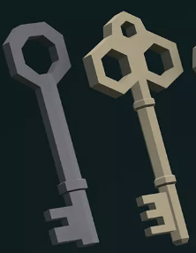

Animation preview

### Physics Mechanics

The core physics mechanics essential to this game include collision detection, knockback calculations, and gravity mechanics. These elements are designed to enhance the understanding of how players, monsters, and the environment interact within the game

##### **+++ Battle system +++**

Battle is the one of important mechanism for the game, it will influence the timing of the game, and the live of players. The core physics mechanics that this game relies on are collision detection and knockback. These fundamental components provide the player with timely feedback on the combat situation, providing the player with an immediate response to successful attacks and incoming enemy strikes. The system consists of the following elements:

+ **Collision Detection:**
  - Determines when characters or weapons come into contact or hit eneymy.
  
  - Essential for implementing accurate hit detection during attacks and for interactions with environmental obstacles. This will affect the healthy points of both enemy and player
  
+ **Forces and Reactions**:

  - Calculates the force exerted and the resultant knockback when a character or enemy is hit.

  - Determines the distance and direction an character moves after being impacted due to contact between objects can cause them to bounce, stop, or change direction.

##### **+++ character system +++**

The characters include NPCs and protagonists. The behavior of NPCs will be controlled by preset scripts, while the protagonists will be controlled by players. Physical elements such as gravity, speed and acceleration will closely interact with their actions, affecting the movement and performance of each character.

+ **Gravity:**
  - affects character fall or move downward. For example, when a character jumps, gravity will pull them back down to the ground. This helps establish a sense of weight and realism in the game.

+ **Velocity and acceleration:**
  - The velocity of the characters in the game will vary. As the player maneuvers the character—whether jumping, changing direction, or engaging in combat—their speed will decrease to enhance realism. During actions like running or stopping, gradually increasing or decreasing speed contributes to smoother, more lifelike movements.

##### **+++ Environment system +++**

- Light and Shadows: Reflections and refractions of light can affect visibility and exploration. We might set different lighting in various rooms. The positions of shadows can indicate time, the status of mechanisms, or hidden elements.
- Sound Propagation: In addition to background music, we will incorporate sounds such as the breaking of objects, running, fighting, and breathing to capture the player's attention.

## Part 5 Art and Audio

### Art Style

**Visual Style**: This game showcases a unique, stylized 3D polygonal art style that enhances its horror theme. This style uses geometric shapes and textures to provide a unique, somewhat blocky aesthetic. The overall furniture style is European architecture, with aged sofas, ancient pianos, and intricate water pendant lamps revealing an aura of age. This visual presentation makes the horror elements more approachable and visually appealing, combining traditional horror themes with a modern art style.

**Character Design**: Characters in the game should be distinctive, each with unique clothing and features. Mistress Emily is a typical little girl figure, and Dean is a tall-hatted, skeletal-looking figure that emphasizes his inner evil and cunning.

**Monster Design**: Different monsters have uniquely designed characteristics, such as the ghosts of children who once lived here but came to a tragic end and congealed, as well as the robust creatures raised by the dean using an unknown potion, all of whom are uniquely distinctive and thus visually intimidating.

**Environment design**: The environment is richly decorated, restoring the structure and design of a real orphanage, such as dormitories, halls and playgrounds. Inside, there are disturbing masks, eerie bloodstains and photos on the wall, casting deep shadows and adding to the horror atmosphere.

**Lighting and Atmosphere**: We plan to use a trailing light to create atmosphere, only a trailing light at the feet of the place where the protagonist is located, the other places for the exploration should be weakly lit and dimly lit, creating a strong dripping nose with the place where the protagonist is located. This will emphasize the exploration and create a sense of tension and mystery in the game.

### Sound and Music

Music plays a crucial role in our games, it not only enhances the player's immersion, but also adds emotion and atmosphere to the game world. With the right sound effects and music, players can more intuitively feel the changes in the scene and the ups and downs of the plot, helping them to deeply understand the story line of the game. At the same time, background sounds can also convey emotions. In addition, background sounds can change dynamically, guiding the player's actions as they go along, making the entire gaming experience more interactive and coherent.

##### +++ background music +++

It is important to set up moving ambient music that complements the atmosphere of the game.

+ **BGM**：https://youtube.com/watch?v=08_2T9IwxAA&list=PLPQlxIMK5VfanG2c4Cz_i_8RG90Fim9uM

We have chosen this BGM as the core background music of the game for the time being. The song has a unique gothic style that creates a spooky atmosphere. It starts with a low piano tone and gradually introduces strings and other eerie sound effects. The tempo in the music is not rushed, but instead slowly advances, and with the dark scenes and broken characters in the game's graphics, it is able to further enhance the player's anticipation and tension in the game world. The melody lines are simple but powerful, especially the strings, which have a subtle emotional charge, as if they were telling the story of Amily's unresolved mysteries and the hidden dangers she faces. All in all, we think this style of music fits the theme of our game very well, with a touch of elegance and mystery, as if introducing the player to a Victorian world full of uncertainty and unknowns.

+ Entering the piano room, the piano music that's automatically being played：https://www.youtube.com/watch?v=oa1R4gPtkzg

There is a piano room in the scene setting, we hope that after the player enters this room, the background music will be automatically switched to piano music, to create a kind of weird atmosphere that no one plays the piano but the sound of the piano is continuous. The piano keys, the unoccupied piano chair, and the continuous sound of the piano, will the player have the courage to face this room...

##### +++ Sound Effect +++

Some sound effects can be added to make the scene more realistic, to achieve a combination of visual and auditory, and to increase the tension atmosphere. We mainly considered the footsteps of the dean, the low roar of the creatures, the breathing of the characters, the sound of the weapons during the fight, and the creation of various sound effects for actions such as environmental interactions. These subtle details enhance the sense of realism and player immersion.

+ Director footsteps:

https://sc.chinaz.com/yinxiao/230507314081.htm

+ The monster hissed:

https://houzi8.com/sound/23320

https://sc.chinaz.com/tag_yinxiao/guaishou.html

+ Character breathing sounds:

https://sc.chinaz.com/yinxiao/220313325433.htm

https://www.aigei.com/sound/class/?sub=nv_ren_hu_xi_sh

+ Fighting sounds:

https://sc.chinaz.com/tag_yinxiao/dadou.html

+++ offscreen voice +++

Subsequent to the second phase, we considered adding off-screen voices to the main characters to deepen their personalities and to contribute to the vividness and continuity of the story.

### Assets

Buy resource packs and make the most of free resources.

Scenery, Characters：https://assetstore.unity.com/packages/3d/environments/fantasy/polygon-horror-mansion-low-poly-3d-art-by-synty-213346

morphology of characters：https://assetstore.unity.com/packages/essentials/starter-assets-thirdperson-updates-in-new-charactercontroller-pa-196526

Character fight status：https://assetstore.unity.com/packages/3d/animations/mega-animations-pack-162341

## Part 6 User Interface (UI)

The user interface includes menus and navigation, status bars and information displays, dialog boxes and captions, and interactive interfaces.

1. **Menu and navigation**
   + Main Menu: The first interface that the player enters the game, containing options to start the game, settings, exit the game, and so on. The design of the main menu is simple and straightforward, while fitting the atmosphere of the game. With the text options in the center of the screen, the background of the main menu is the outside of the orphanage compound and is accompanied by dim lighting, spreading tree trunks, and subtle sound effects to enhance the spooky atmosphere.
   
   + Settings Menu: players can adjust options such as volume level in the settings menu. We chose to use a collapsed menu to organize the different types of settings and ensure ease of use.
   
   + Start/pause menu: However, it can be invoked at any time during the game, and the pause menu can include options such as returning to the main menu, restarting the level, and exiting the game. At the same time, when pausing, you should consider making the scene temporarily static to keep the player's memory of the current environment.
   
2. **Status bar and information display**
   + Life Value: The player's status bar is placed directly below the screen and displays the player character's life value in real time. The life value is displayed via the **Blood Bar**.
   + Item and Clue Hints: Pop-up hints can appear on the screen when the player obtains important props or unlocks new clues. For example, when Amily finds an escape key, a small icon can appear on the right side of the screen accompanied by a short text description. Pop-ups can be avoided by using the **fade out** method to avoid interrupting the player's gaming experience.
   
   + Clue Text: When the player triggers a key scene or item, a short text can pop up to hint at important clues or story background. These texts can appear automatically in the corners of the screen and fade out, allowing the player to quickly capture information without interrupting the pace of the game.
   
3. **Interactive interface**
+ Backpack and props management: When players open their backpacks, they need to see a list of **items**, a description of **items**, and **the number of items currently held**. The backpack interface is simple and easy to use, items are neatly arranged and can be categorized for browsing (e.g. quest props, consumables, weapons), with a grid of about 6-7. The backpack interface supports quick drag-and-drop operations so that players can quickly equip or use items.
  
+ Weapon Switching and Attack Indication: If there is a weapon system in the game, when the player switches weapons, the weapon icon and attributes of the currently equipped weapon can be displayed**. When using a weapon to attack an enemy, the visual or audio feedback can be used to enhance the attack's **hit feeling. For example, a brief flashing effect or vibration feedback can appear when the attack hits.
  
+ Object Interaction Hints: **Hint buttons** can appear on the screen when Emily is near an interactable object (e.g. the mouse shape changes when the corresponding point is triggered), thus letting the player know that it is possible to interact with the environment. These cues should dynamically appear or disappear as Emily approaches or moves away from the item.

## Part 7 Technology and Tools

The game was developed using Unity version 2022.3.81f1 LTS, using popular c# code editors such as Visual Studio and Visual Studio code, supporting WebGL version and running in a web browser. In addition, we use Git and GitHubGit to support code hosting and version control, and team collaboration to develop the game.

**Unity internal technology:**

1. Use custom shaders (ShaderLab and Shader Graph) to write or visualize complex material effects. 

2. Collider for collision detection and physics response.
3. Use the Rigidbody FPS controller to control player character movement and interaction. 
4. control complex animation switching, playing and mixing through the Animator controller, which can be used for character movement, UI animation and so on.
5. the use of Cinemachine combined with custom scripts to control the camera.
6. using Audio Mixer to achieve precise control of various audio elements, including environmental sound effects, music and sound effects.

Also, we will be using the **Procedure Generation** technique to dynamically generate monster locations and types in the game. The details are as follows:

1. Monster generation logic:
   - Monsters will be randomly spawned within a limited map area, and the spawning locations follow the rules below:
     1. Each time it spawns, make sure the monsters will not appear in the player's field of vision, giving the player some time to explore.
     2. The number of each type of monster will be adjusted according to the current progress of the game to ensure the balance of the game.
     3. The location of monster generation is randomized, but will be appropriately limited according to the map's terrain and environmental conditions to ensure that the generated monsters can adapt to the current terrain.

2. Monster Types and Attributes：
   - We customized three types of monsters, each with a unique attack style and attack power:
     1. Monster A: Melee attack, swinging fists to attack, weak attack power.
     2. Monster B: Magic attack, shooting magic balls, medium attack power.
     3. Monster C: Ranged attack, swing axe, high attack power.

With these procedurally generated rules, we aim to provide players with a diverse and randomized gaming experience while keeping the levels manageable and interesting.

Depending on the subsequent needs, we will add more algorithms, tools or special scripts to assist in the process, so as to achieve the goal of reduced workload, high compatibility and playability.

## Part 8 Team Communication, Timelines and Task Assignments

### Team Member

|       keys       |                Email                | Team Role                         |
| :--------------: | :---------------------------------: | --------------------------------- |
| Jiayi Wang(Ivy)  |  jiawang10@student.uniemlb.edu.au   | product manager,  test Engineer   |
|  Yan Gong(Rita)  |   yagong1@student.unimelb.edu.au    | Core developer,  schedule manager |
| Yuetong Li(Tina) |   yuetong4@student.unimelb.edu.au   | Core developer, art designer      |
|   Yifan Zhang    | yifanzhang13@student.unimelb.edu.au | Core developer, test Engineer     |

### Team Communication

We take a multi-faceted approach to teamwork and document the development process and progress at all times. This includes:

Team communication tools using Slack and WeChat groups for general communication, Trello boards for planning progress and assigning tasks, Google Docs to record shared iterations of GDD documentation, GitHub repositories for hosting code, sharing local folders or assets via Google Drive or Baidu.com as needed, and Zoom or offline meetings for regular communication and progress coordination.

Our team uses Agile development methodologies, setting weekly delivery goals and continuously adjusting and refining the work as the project progresses. To ensure an even distribution of work, we regularly merge code into a master branch on Github and decompose complex logic so that the behavior of individual units and their interactions with the environment can be developed as independently as possible. Additionally, through dialogue and collaboration between team members, we coordinate and complete interactions between units to optimize the overall development process. If a unit encounters a development bottleneck, the other team members will work together to solve it, always keeping in mind the important concepts of a team project and ensuring the efficiency of the development.

##### +++ Slack +++

+ Confirmation of meeting attendance: The group meets offline on Wednesday afternoons in a weekly cycle. Times are confirmed with each other in Slack prior to the meeting to ensure attendance. If there is a time conflict that week, alternative meeting times are explored.
+ Additional task assignments: Tasks not noted in the meeting are added here to make sure no tasks are missing or unclearly assigned.
+ Brainstorming: Mutual discussion of technical difficulties to overcome and details of the game to be handled, thus ensuring time and efficiency. Considering that the core of the project is teamwork, even if the tasks are each other's others will share resources on the network, think about contradictions and help each other to solve problems.

##### +++ Meeting schedule +++

The meeting cycle will consist of at least one offline meeting per week, usually on Wednesday afternoons in the ERC library. occasional online meetings will be held depending on workload and urgency of needs.

Phase 1 offline meeting topics are listed below. The meeting breakdown has been tasked with updating to trello. wk2: Setting up the game plot, game story and design direction. Discuss the team's areas of expertise and explore priorities for subsequent development work. wk3: Finalize game name and core concepts. Assign GDD drafting tasks, research available external resources and harmonize testing.Wk4: GDD feedback and discuss details, update each, assign development tasks.Wk5: Continue revising last week's work, look at gaps in GDD. Discuss details on art. Discuss Unity technical issues Wk6: Presentation of current stage results, further testing, explore feasibility of newly incorporated elements

##### +++ Trello Board +++

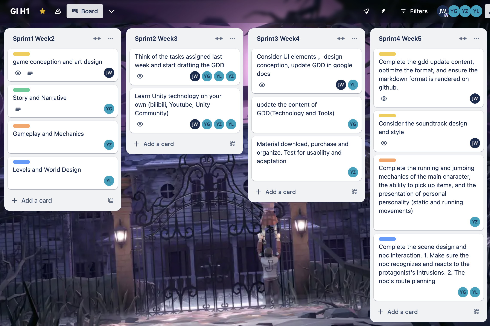

https://trello.com/invite/b/66bf42a0582201bdc11fb00f/ATTI08e9d5351ab650a6445a5a1949bdfcadDC2B2DC0/gi-h1

### Timelines

##### +++ Preparation +++ From Week 1 to Week 4

+ Game design and concept

  + Game design documentation development
    + Game document structure, document main content, unified Assignmenthe core requirements and score criteria
    + Core game background, dispersal of story thinking, harmonization of story lines
  + Story, art and character design
    
    + Discussion of art material sources
    + Character names, likenesses, core characters, scene styles

+ Team Project Tools

  + Project management tool setup
    
    + Set up a project management tool, create a Trello board team for regular task assignments and progress tracking (mainly handled by Jiayi).
    + Setup document management tool, Google Docs for GDD game document iteration, technology development tracking, etc. (mainly by Jiayi). (Jiayi is mainly responsible for this)
    
  + Version Control System Implementation
    
    + Create a GitHub repository and set up a version control system. (Github manager: Yan)

+ Plan team vision and schedule

  + Establish regular meeting times to align team goals

##### +++ Began Foundational Game Development +++ From Week 3 to Week 6

+ Basic framework for game engine
  + Development of the basic framework of the game engine, including player controls, camera system, and physics engine.
+ Game Level Design
  + Design and model the first game level, including room layout and item placement.
+ Player Character Controls
  + Implement basic player character controls, including movement, jumping, aiming, and shooting functions.

#####  +++ Expansion of Gameplay content (If given enough time) +++ 

+ ##### Extended Design

  - Expand the game map, second floor room layout
  - Add more character off-screen voices, resulting in a more immersive game with fuller characters.
  - Consider whether to create additional items and weapons to enhance the player's strategic choices as well as the overall gameplay mechanics of the game.

##### +++ Game Testing and Optimization +++

+ internal testing
  + Functional testing
    + **Purpose**: Ensure that the functionality in the game works correctly according to the design specifications. This includes game mechanics, user interface interactions, network functions, archiving systems, etc.
    + **Methodology**: Testers execute each feature in the game according to the design documentation to ensure that each feature works correctly.
  + Performance Testing
    + **Purpose**: Ensure that the game runs smoothly on a variety of hardware, with no performance issues such as dropped frames, latency, or memory leaks.
    + **Methodology**: Run the game using various configurations of hardware to monitor and record performance metrics such as frame rates, load times, and response times.
  + User experience testing
    + **Purpose**: Ensure that the game interface is intuitive and easy to use and that the game experience meets the expectations of the target users.
    + **Methodology**: Evaluate the logic and aesthetics of the interface design to ensure that information is clear and easy to read and controls are responsive.
  + Compatibility Testing
    + **Purpose**: Ensure that the game runs correctly on various system configurations, operating system versions, and hardware.
    + **Methodology**: Test the game on different operating systems (e.g. Windows, macOS, Linux), different versions of hardware.
  + Security testing
    + **Purpose**: Ensure that the game software and player data are secure against external attacks and cheating.
    + **Methods**: Check the data encryption method of the game and test whether the game is vulnerable to external attacks or cheating software.
  + Stress Test
    + **Purpose**: Simulate the performance of the game under extreme conditions, such as when the server is extremely loaded.
    + **Method**: Simulate high traffic and high data processing demands on the game server to observe the game's response and stability.
+ Detailed Optimization
  + Graphics and rendering optimization
    + Reduce rendering burden by using different model detail levels that dynamically adjust based on the object's distance from the camera.
    + Optimized shader code with simpler materials and textures to reduce GPU burden.
  + Scripting and logic optimization
    + Resolve in-game bugs and logic issues to enhance stability.
  + User Interface Improvements
    + Optimize user interface response times to ensure immediate feedback on actions.
    + Optimized HUD and other interface elements to avoid over-rendering and reduce screen clutter.

## Part 9 Possible Challenges

1. Resource and time management

   + Description of the problem: You will be faced with limited resources, including time and manpower. Each team member may need to handle multiple roles and tasks, such as programming, design, art production, and testing.

   + How to solve: Manage time and resources efficiently to ensure the project is completed on time and with the expected quality, while avoiding overwork of team members. Assist each other with problems to improve efficiency.
2. Incomplete coverage of skills and specializations

   + Description of the problem: Team members have no experience in Unity game development, so a lot of time needs to be invested in technical and operational familiarization upfront, which may lead to uncontrollable timelines and other issues.

   + How to solve: These skill gaps need to be bridged through self-study, outsourcing, or the use of off-the-shelf assets and tools, while maintaining the overall coordination and quality of the project. If you come across a good self-study project, you can share it with each other, recommended platforms include bilibili and Youtube. you can also learn about the knowledge points by accessing CSDN or AI tools, and the team develops an internal message board document dedicated to solving the problem, so that if you have a question, you can post it on it and wait for a reply from a member who understands it.
3. Communication and Collaboration

   + Description of the problem: In the face of teamwork, it is likely that misunderstandings and inefficiencies will be encountered due to insufficient communication or improper collaboration. If there is no unity of opinion, it may also deviate from the initial setting, leading to problems with the game's logic.
   + How to solve:: Establish effective communication channels and team collaboration mechanisms to ensure that each member can obtain the necessary information and support in a timely manner. Use the support tool Trello to plan and monitor project progress.
4. Technical and Performance Issues

   + Problem description: When developing complex games using Unity, you may encounter technical issues such as performance optimization and version incompatibility.
   + How to solve: find better solutions, utilize school ed resources, ask school tutors, team members assist each other.

